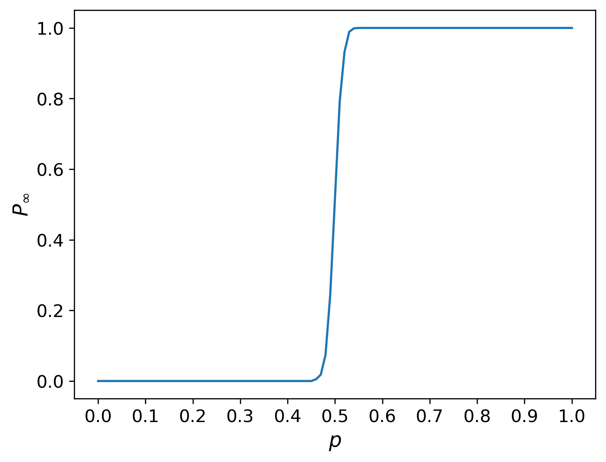

# Bond percolation in a 2D regular grid

This Python program simulates the classical bond percolation problem on a
two-dimensional regular lattice. The simulation is performed multiple times
for a lattice of size Lx x Ly to compute the percolation transition
of the system.

A description of this problem can be found, for example, in:
https://arxiv.org/abs/2006.14496  
where it is discussed in the context of robust network connectivity.

The program finally generates a plot of the percolation probability of the
system as a function of the bond occupation probability.

## 🛠️ Technologies
- Python
- NumPy
- Matplotlib

## ▶️ Execution
python bondPercolation.py
